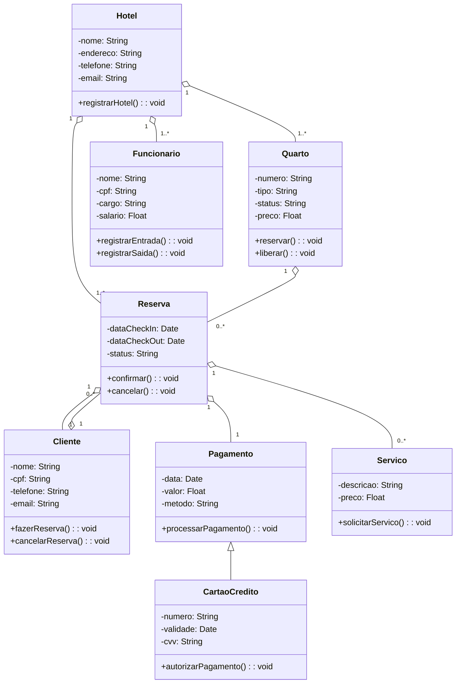

```mermaid

classDiagram
    class Hotel {
        -nome: String
        -endereco: String
        -telefone: String
        -email: String
        +registrarHotel(): void
    }

    class Quarto {
        -numero: String
        -tipo: String
        -status: String
        -preco: Float
        +reservar(): void
        +liberar(): void
    }

    class Reserva {
        -dataCheckIn: Date
        -dataCheckOut: Date
        -status: String
        +confirmar(): void
        +cancelar(): void
    }

    class Cliente {
        -nome: String
        -cpf: String
        -telefone: String
        -email: String
        +fazerReserva(): void
        +cancelarReserva(): void
    }

    class Pagamento {
        -data: Date
        -valor: Float
        -metodo: String
        +processarPagamento(): void
    }

    class CartaoCredito {
        -numero: String
        -validade: Date
        -cvv: String
        +autorizarPagamento(): void
    }

    class Funcionario {
        -nome: String
        -cpf: String
        -cargo: String
        -salario: Float
        +registrarEntrada(): void
        +registrarSaida(): void
    }

    class Servico {
        -descricao: String
        -preco: Float
        +solicitarServico(): void
    }

    Hotel "1" o-- "1..*" Quarto
    Hotel "1" o-- "1..*" Funcionario
    Hotel "1" o-- "1..*" Reserva
    Quarto "1" o-- "0..*" Reserva
    Reserva "1" o-- "1" Cliente
    Reserva "1" o-- "0..*" Servico
    Reserva "1" o-- "1" Pagamento
    Cliente "1" o-- "0..*" Reserva
    Pagamento <|-- CartaoCredito

```
